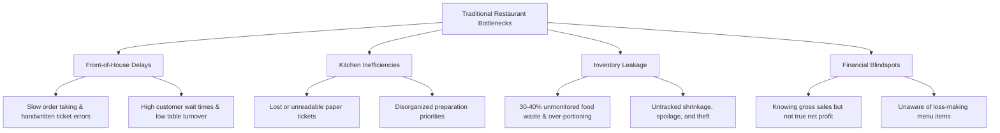
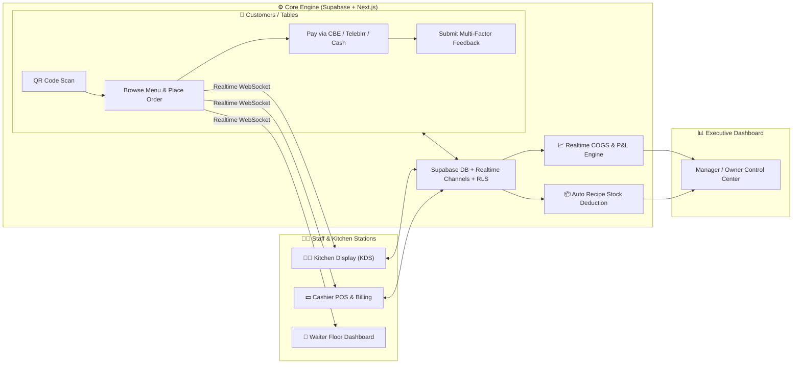
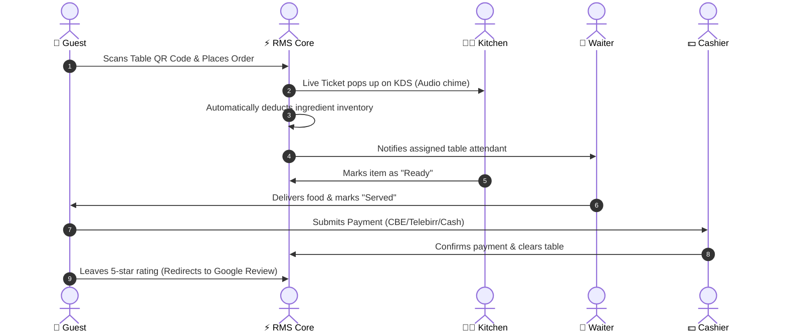

# 🍽️ Restaurant Management System (RMS)
### *Next-Generation Real-Time Restaurant Operating System & Financial Intelligence Platform*

---

## 📌 Presentation Overview & Slide Index

| Slide # | Section Title | Focus Area |
|:---:|:---|:---|
| **01** | **Title & Executive Summary** | The Vision, Elevator Pitch, Key Metrics |
| **02** | **The Problem (Industry Pain Points)** | Manual chaos, leakage, inventory waste & blind finance |
| **03** | **The Solution & Core Architecture** | Real-time ecosystem overview & technology stack |
| **04** | **Key Modules & System Features** | The 6 core functional pillars of RMS |
| **05** | **User Persona Journeys** | Customer, Waiter, Chef, Cashier, Manager |
| **06** | **Technical Architecture & Data Flow** | Next.js, Supabase Realtime, WebSockets & RLS |
| **07** | **Offline Resilience & Ethiopian Localization** | Telebirr, CBE, Fayda ID, Amharic support & Offline sync |
| **08** | **Financial & Inventory Intelligence** | Real-time COGS, Recipe BOM, Menu Engineering Matrix |
| **09** | **ROI & Business Value Proposition** | Break-even metrics, waste reduction, margin growth |
| **10** | **Live Demo Script & Walkthrough** | 5-minute end-to-end presentation flow |

---

<!-- SLIDE 1 -->
# 🚀 Slide 1: Executive Summary & Vision

> **"Transforming restaurants from chaotic manual operations into data-driven, real-time automated businesses."**

### 🌟 What is RMS?
The **Restaurant Management System (RMS)** is a modern, unified cloud and edge-ready web application engineered to run front-of-house, back-of-house, and executive analytics seamlessly in real time. 

Built with **Next.js 16 (App Router)**, **React 19**, **TypeScript**, and **Supabase (PostgreSQL + Realtime Engine)**, it replaces fragmented legacy POS systems with an integrated, friction-free platform.

### 🔑 Key Highlights at a Glance
- 📱 **100% App-Free QR Table Ordering**: Zero downloads required for diners.
- ⚡ **Real-Time Sub-Second Sync**: Kitchen tickets, floor status, and stock sync instantly via WebSockets.
- 🥩 **Recipe-Driven Automatic Inventory Deduction**: Stock automatically decrements down to the gram/milliliter upon each order.
- 💳 **Localized Multi-Rail Payments**: CBE Bank Transfer, Telebirr/Telegram validation, and cash verification.
- 📊 **CFO-Level Financial Intelligence**: Live calculation of COGS (Cost of Goods Sold), Gross Profit, and True Net Profit.

---

<!-- SLIDE 2 -->
# ⚠️ Slide 2: The Problem — The High Cost of Manual Operations

Traditional restaurants and cafés suffer from severe operational friction and revenue leakage across multiple operational layers:



### 📉 Critical Industry Pain Points:
1. **Order Latency & Errors (15% Error Rate)**: Misheard orders, lost paper tickets, and billing disputes during peak rush hours.
2. **Untracked Food Waste & Stock Shortages**: Running out of key ingredients mid-service or wasting perishable stock due to lack of real-time BOM (Bill of Materials) tracking.
3. **Staff Accountability & Time Theft**: Dispute-heavy manual attendance, ghost shifts, and lack of objective performance tracking.
4. **Blind Financial Reporting**: Traditional POS tracks revenue, but fails to tie daily ingredient costs and operational expenses into a live P&L statement.

---

<!-- SLIDE 3 -->
# 💡 Slide 3: The Solution — Unified Real-Time Architecture

RMS replaces paper tickets, isolated POS machines, and complex spreadsheets with a single connected ecosystem:



---

<!-- SLIDE 4 -->
# 📦 Slide 4: Six Core Functional Modules

### 1️⃣ Digital Table Ordering (`/order/[tableCode]`)
- Dynamic QR generation mapped to physical tables.
- Category filtering, dietary tags, visual cart, and custom preparation notes.
- Live progress tracker: `Placed` ➔ `Preparing` ➔ `Ready` ➔ `Served`.

### 2️⃣ Kitchen Display System (`/chef/dashboard`)
- Interactive station cards sorted chronologically.
- One-click order state transitions with audible audio alerts.
- Filter by station and urgent order timers to eliminate lost tickets.

### 3️⃣ Cashier & Floor Management (`/cashier`)
- Quick-bill settlement with receipt generation.
- Real-time floor status: **Free**, **Occupied**, **Reserved**, **Billed**.
- Payment slip verification for bank transfers and Telebirr.

### 4️⃣ Staff HR & Shift Management (`/admin/staff`)
- Legal compliance profiles (National ID/Fayda verification, emergency contacts).
- **2-Factor Clock-in**: Daily rotating dynamic code + personal employee PIN.
- Real-time waiter performance scores driven directly by guest feedback.

### 5️⃣ Recipe-Driven Inventory Engine (`/admin/inventory`)
- Multi-unit tracking: Grams, Milliliters, Pieces.
- **Bill of Materials (BOM)**: Each dish recipe automatically deducts raw ingredient stock upon order confirmation.
- Out-of-stock auto-lock: Dishes disable automatically when ingredients run out.

### 6️⃣ Financial P&L Analytics (`/admin/finance`)
- True Net Profit = `Revenue - (COGS + Fixed & Variable OPEX)`.
- Channel breakdown: Dine-In vs. Takeout vs. Delivery.
- **Menu Engineering Matrix**: Stars (High Margin/High Volume), Plowhorses, Puzzles, and Dogs.

---

<!-- SLIDE 5 -->
# 👥 Slide 5: User Persona Journeys



---

<!-- SLIDE 6 -->
# 🛠️ Slide 6: Technical Architecture & Tech Stack

| Tier | Technology | Purpose & Architectural Advantage |
|:---|:---|:---|
| **Frontend Framework** | **Next.js 16 (App Router)** | Server Components, fast SSR, React Server Actions, zero-bundle overhead |
| **UI & Styling** | **React 19 + Tailwind CSS 4** | Ultra-responsive mobile-first design, micro-animations, modern layout |
| **Icons & Media** | **Lucide Icons + QRcode** | Lightweight vector icons and dynamic table QR generation |
| **Backend & DB** | **Supabase (PostgreSQL 15+)** | ACID compliance, complex relational schema, relational foreign keys |
| **Realtime Engine** | **Supabase Realtime WebSockets** | Sub-second broadcast events across Kitchen, Floor, and Cashier |
| **Security & RBAC** | **Row Level Security (RLS) + JWT** | Role segregation: Admin, Manager, Cashier, Chef, Waiter, Public |
| **Offline Handling** | **Local Cache & Sync Banner** | Graceful fallback during intermittent connection drops |

---

<!-- SLIDE 7 -->
# 🇪🇹 Slide 7: Localization & Resilient Design

RMS was crafted with specific operational resilience for dynamic emerging markets and Ethiopian hospitality:

```
┌────────────────────────────────────────────────────────────────────────┐
│                        LOCALIZED ADAPTATIONS                           │
├────────────────────────────────────────────────────────────────────────┤
│ 💳 Multi-Rail Payments   │ CBE Account/QR, Telebirr/Telegram, Cash     │
│ 🛡️ Staff Verification    │ National ID (Fayda) & Digital Contracts    │
│ 📶 Network Resilience    │ Offline state detection & sync banners      │
│ ⭐ Reputation Funnel      │ 4-5★ ratings routed to Google Business     │
│                          │ 1-3★ ratings routed to private manager inbox │
│ 🌐 Multilingual Ready    │ English & Amharic typography support        │
└────────────────────────────────────────────────────────────────────────┘
```

---

<!-- SLIDE 8 -->
# 📈 Slide 8: Real-Time Financial & Inventory Intelligence

### 🥩 How Recipe Auto-Deduction Works:
When a customer orders **"Special Burger" (Quantity: 1)**:
- ➖ Beef Patty: `200g` deducted from Meat Walk-in Freezer.
- ➖ Burger Bun: `1 pc` deducted from Bakery Storage.
- ➖ Cheddar Cheese: `30g` deducted from Dairy Fridge.
- ➖ Special Sauce: `25ml` deducted from Prep Line.

### 📊 Menu Engineering Matrix:
RMS automatically groups every menu item into 4 quadrants based on profitability and popularity:

```
                      High Profitability
                             ▲
              PUZZLES        │        STARS
         (High Margin,       │    (High Margin,
           Low Volume)       │     High Volume)
                             │
     ◄───────────────────────┼───────────────────────► High Popularity
                             │
               DOGS          │     PLOWHORSES
          (Low Margin,       │    (Low Margin,
           Low Volume)       │     High Volume)
                             ▼
                      Low Profitability
```

---

<!-- SLIDE 9 -->
# 💰 Slide 9: Business Value & Return on Investment (ROI)

### 📊 Tangible Operational Savings:
- ⏱️ **65% Faster Order Taking**: Eliminates wait time for waiters to handwrite and carry paper tickets.
- 📉 **30-40% Reduction in Food Waste**: Precise recipe portioning and variance reports prevent over-prepping.
- 🚫 **100% Elimination of Shift Time Theft**: Dispute-proof 2-factor clock-in code stops buddy-punching.
- 📈 **20-30% Increase in Table Turnover**: Faster ordering, preparation, and billing cycles.

### 💵 Payback Timeline:
| Restaurant Profile | Initial Investment | Estimated Monthly Savings | Average Payback Period |
|---|:---:|:---:|:---:|
| **Café / Small Eatery** (5-15 tables) | ~180,000 ETB | ~26,000 ETB / mo | **6.9 Months** |
| **Medium Restaurant** (16-40 tables) | ~495,000 ETB | ~93,000 ETB / mo | **5.3 Months** |
| **Large Hotel / Fine Dining** (40+ tables) | ~1,200,000 ETB | ~265,000 ETB / mo | **4.5 Months** |

---

<!-- SLIDE 10 -->
# 🎬 Slide 10: 5-Minute Live Presentation & Demo Script

Follow this step-by-step workflow during a live client or stakeholder demonstration:

```markdown
1. [00:00 - 01:00] THE HOOK (Customer Table Flow)
   - Open mobile browser or scan Table QR (`/order/T-04`).
   - Add items to the cart, add a special request ("Extra spicy"), and hit "Place Order".

2. [01:00 - 02:15] BACK-OF-HOUSE MAGIC (Kitchen & Staff)
   - Switch screen to Chef KDS (`/chef/dashboard`).
   - Point out the instant ticket arrival with live sound alert.
   - Transition order status from "Placed" ➔ "Preparing" ➔ "Ready".
   - Show how the customer's phone updates instantly without page refresh.

3. [02:15 - 03:15] BILLING & FEEDBACK FUNNEL
   - Open Cashier screen (`/cashier`).
   - Validate CBE / Telebirr transaction and mark as Paid.
   - On the customer phone, complete the 5-star rating review and demonstrate the Google Review redirect.

4. [03:15 - 04:15] INVENTORY & FINANCIAL INTELLIGENCE
   - Open Admin Dashboard (`/admin/inventory`).
   - Show the exact stock levels that decremented after the burger was ordered.
   - Open Financials (`/admin/finance`) to show live gross profit and net margin calculations.

5. [04:15 - 05:00] SUMMARY & CALL TO ACTION
   - Summarize the business impact (ROI, loss reduction, customer satisfaction).
   - Open for Q&A.
```

---

## 📞 Contact & Presentation Notes
- **Developed with**: Next.js 16, React 19, TypeScript, Supabase, Tailwind CSS
- **Deployment Ready**: Vercel / Docker / Supabase Cloud
- **Licensing Model**: Full Source Code Ownership + Managed Hosting & Support
