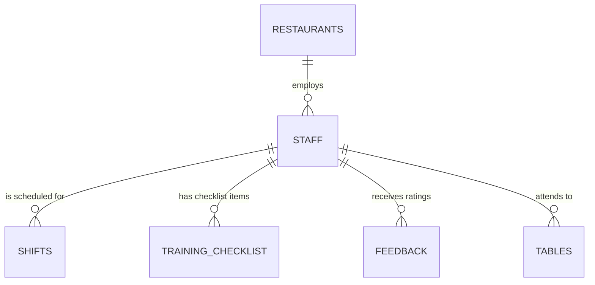
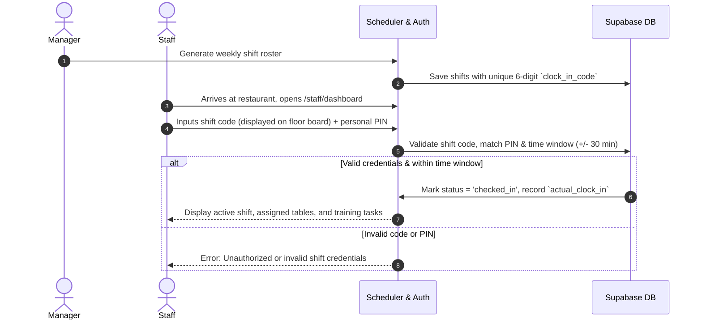

# Module 01: Staff & Shift Management

## 1. Overview & Operational Goals
The Staff & Shift Management module transforms restaurant staffing from chaotic manual scheduling and untracked attendance into an automated, legally compliant, dispute-proof HR and shift management system.

### Key Capabilities:
1. **Comprehensive Legal/HR Personnel Records**: National ID / Fayda verification, document uploads, emergency contact details, base salary contracts, and employment status lifecycle.
2. **Dynamic Shift Scheduler & Conflict Detection**: Visual shift planning with automated overlap prevention, role-based requirements (waiters, cooks, cleaners), and table assignments.
3. **Dispute-Proof Clock-In Engine**: Two-factor shift check-in combining an admin-generated daily/shift code with the employee's personal secret PIN.
4. **Interactive Training Checklists**: Step-by-step role-specific onboarding checklists verified by supervisors.
5. **Real-time Performance Scorecards**: Rolling weighted scores from direct customer reviews attached to every staff member.

---

## 2. Data Models & Entities

### 2.1 Staff HR Fields
- `personal_id_number`: National ID (Fayda in Ethiopia, Passport, or Kebele ID).
- `personal_id_doc_url`: Scanned copy stored in `supabase-storage/staff-docs/`.
- `emergency_contact_name` & `emergency_contact_phone`: Mandatory contact for workplace safety.
- `role`: `waiter`, `cook`, `cleaner`, `host`, `manager`, `admin`.
- `employment_status`: `active`, `on_leave`, `terminated`.
- `base_salary`: Monthly base wage used by Finance module to compute operational expenses.

---

## 3. Shift Scheduling & Clock-In Workflow

### 3.1 Shift Status Transitions
- `scheduled`: Created by manager, awaiting staff arrival.
- `checked_in`: Successfully validated with code + PIN within allowable grace period.
- `late`: Checked in after the scheduled start time plus grace threshold (e.g. >15 mins late).
- `completed`: Clocked out at end of shift with recorded `actual_clock_out`.
- `missed`: Did not check in before shift scheduled end.

---

## 4. Training Checklist Engine

Every role has a standard curriculum that new hires must complete:

| Role | Standard Checklist Modules |
|---|---|
| **Waiter** | 1. Table Etiquette & Greeting Standards 2. Digital Menu & Allergen Knowledge 3. QR Table System & CBE/Telebirr Verification 4. Complaint Handling & Escalation |
| **Cook** | 1. Kitchen Hygiene & HACCP Storage 2. Recipe Portions & Ingredient Measurement 3. Order Preparation Timings 4. Waste Logging Procedures |
| **Cleaner** | 1. Chemical Safety & Dilution Rules 2. Table Sanitization & Turnover Protocol 3. Restroom Inspection & Restocking Log |

Managers sign off each item with a single click in the Admin portal, updating `training_checklist.verified_by` and `training_checklist.completed_at`.

---

## 5. Staff Performance Index

Staff performance is continuously updated using customer feedback submitted via `/order/[tableCode]/feedback`:
- **Formula**:
  $$\text{Score} = \frac{\sum_{i=1}^{N} \text{Feedback Weighted Rating}_i}{N}$$
- If score drops below `3.5 / 5.0`, an automated coaching flag is raised on the manager's dashboard.
- Top-rated waiters are automatically suggested for peak evening shifts.
