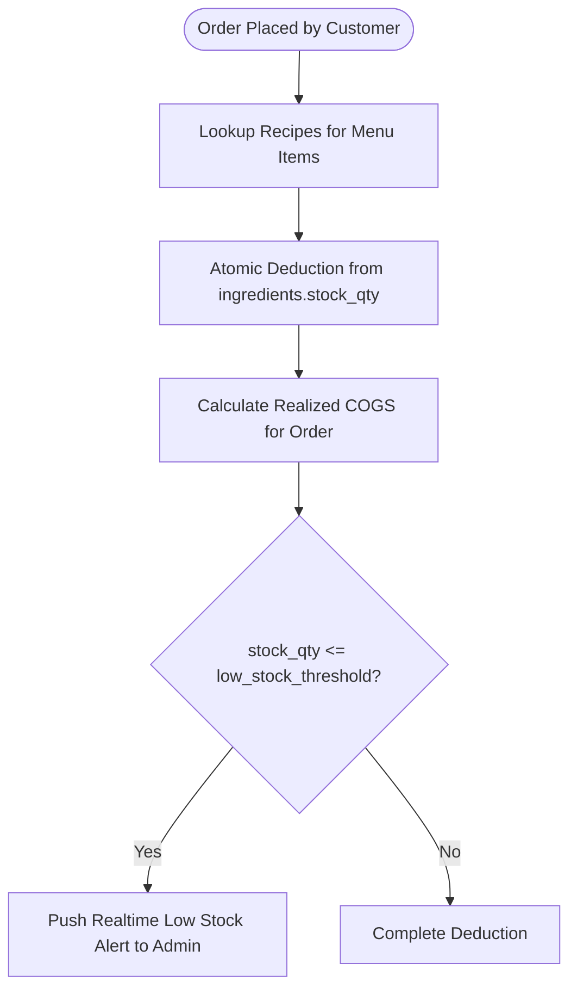

# Module 02: Inventory & Recipe Management

## 1. Overview & Operational Goals
The Inventory & Recipe Management module eliminates kitchen shortages, stock shrinkage, and untracked food waste by linking raw inventory directly to the digital menu via exact Bill-of-Materials (BOM) recipes.

### Key Capabilities:
1. **Multi-Unit Ingredient Tracking**: Real-time stock levels measured in precise standard units (`gram`, `ml`, `piece`).
2. **Instant Order-Driven Deductions**: When a customer places an order, the system executes atomic stock reductions across all recipe ingredients in the background.
3. **Automated Low-Stock Alerts**: Real-time visual toasts and warning badges on the admin dashboard when items reach their configurable `low_stock_threshold`.
4. **Automated Recipe COGS Calculation**: Real-time item cost calculated from ingredient unit prices:
   $$\text{COGS}_{\text{Item}} = \sum (\text{Quantity Required}_i \times \text{Cost per Unit}_i)$$
5. **Weekly Physical Stock Reconciliation**: Manager enters physical inventory counts to calculate variance and pinpoint shrinkage, over-portioning, or waste.

---

## 2. Recipe Structure & Deduction Workflow



### 2.1 Example Recipe Bill-of-Materials (BOM)

#### Menu Item: *Special Beef Burger with Fries* (Selling Price: 450 ETB)
| Ingredient | Unit | Qty per Serving | Unit Cost (ETB) | Cost Contribution (ETB) |
|---|---|---|---|---|
| Beef Patty | piece | 1 | 90.00 | 90.00 |
| Burger Bun | piece | 1 | 20.00 | 20.00 |
| Cheese Slice | piece | 1 | 25.00 | 25.00 |
| Lettuce & Tomato | gram | 50 | 0.40 | 20.00 |
| Cooking Oil | ml | 30 | 0.25 | 7.50 |
| Potatoes (Fries) | gram | 200 | 0.12 | 24.00 |
| **Total Recipe COGS** | | | | **186.50 ETB (41.4% Food Cost Margin)** |

---

## 3. Stock Level Lifecycle & Inventory States

```
[Restocked] ──> Stock Level High ──> [Order Deductions] ──> [Threshold Reached: Warning] ──> [Stock = 0: Auto Out-of-Stock]
```

### 3.1 Out-of-Stock Protection
If an ingredient reaches `0`, the system automatically sets `is_available = false` on all associated `menu_items`, preventing customer orders for dishes that the kitchen cannot prepare.

---

## 4. Periodic Stock Audit & Discrepancy Reconciliation

Assigned inventory staff or managers conduct physical audits every 2–3 days or weekly:
1. System outputs expected theoretical remaining balance:
   $$\text{Expected Stock} = \text{Initial Stock} + \text{Restocked Qty} - \text{Total Recipe Deductions} + \text{Restored Cancelled Qty}$$
2. Staff conducts manual kitchen count and inputs `Physical Count`.
3. System calculates **Discrepancy Variance**:
   $$\text{Variance} = \text{Physical Count} - \text{Expected Stock}$$
   $$\text{Financial Loss} = |\text{Variance}| \times \text{Cost per Unit}$$
4. If variance exceeds the set tolerance threshold, the discrepancy is flagged on the admin dashboard with root cause tagging (`kitchen_waste`, `spoilage`, `theft`, `over_portioning`).

---

## 5. Order Cancellation & Dispute Inventory Reversal
When an order item is marked `disputed` or `cancelled`:
1. The system atomically adds back the recipe ingredients to `ingredients.stock_qty`.
2. Re-adjusts the order's `calculated_cogs` to ensure inventory balances and financial reports remain 100% accurate.
3. Logs the cancellation reason (`customer_cancelled`, `order_dispute`, `kitchen_error`) for wastage reporting.
