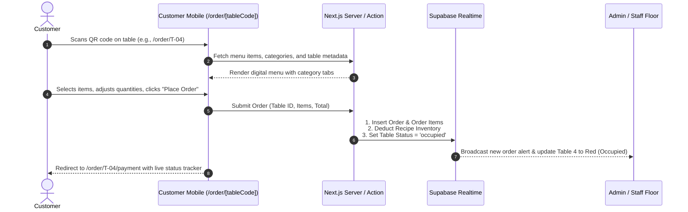

# Module 03: Digital Ordering & Table Floor Management

## 1. Overview & Operational Goals
The Digital Ordering & Table Management module replaces slow manual paper orders with instant QR code ordering and a live digital floor map.

### Key Capabilities:
1. **Dynamic QR Code Table URLs**: Unique, friction-free customer access via `/order/[tableCode]` with no mandatory app download or login.
2. **Interactive Digital Menu & Visual Cart**: Filter by category (starters, mains, drinks, desserts), customize item quantities, and specify special preparation notes.
3. **Live Floor Table Management**: Interactive real-time floor plan showing table occupancy (`free`, `occupied`, `reserved`), active orders, and attendant coverage.
4. **Automated Attendant Assignment**: Every table is linked to a scheduled staff member on duty, ensuring prompt service and direct performance accountability.
5. **Multi-Channel Support**: Seamlessly supports `dine_in`, `takeout`, and `delivery` order channels.

---

## 2. Customer QR Ordering Workflow



---

## 3. Floor Plan Status & Visual State Rules

| State | Badge Color | Definition | Trigger Event |
|---|---|---|---|
| **Free** | Emerald Green | Table is vacant and ready for seating | Settled payment / Table cleared |
| **Occupied** | Amber / Orange | Guests seated; active order in progress | Customer places order or staff seats guests |
| **Reserved** | Indigo Blue | Pre-booked for upcoming dining party | Manager marks reservation via Admin |

---

## 4. Kitchen & Staff Order Pipeline

Orders move through a comprehensive operational lifecycle:

```
[placed] ──> [preparing] ──> [ready] ──> [served] ──> [paid] ──> [archived]
   │             │
   └─────────────┴───> [disputed / cancelled] (Inventory auto-restored in real time)
```

1. **`placed`**: Customer completed order submission; buzzer/toast rings on Kitchen Display System (KDS) and assigned waiter dashboard.
2. **`preparing`**: Kitchen cook acknowledges order and starts food preparation.
3. **`ready`**: Kitchen signals food is cooked and plated, ready for waiter pickup.
4. **`served`**: Waiter delivers food to table; timestamps fulfillment duration.
5. **`paid`**: Payment confirmed by customer via transfer or waiter/cashier via cash verification.
6. **`disputed / cancelled`**: If an item is wrong or returned, staff flags it; recipe ingredients are immediately added back to inventory stock.
