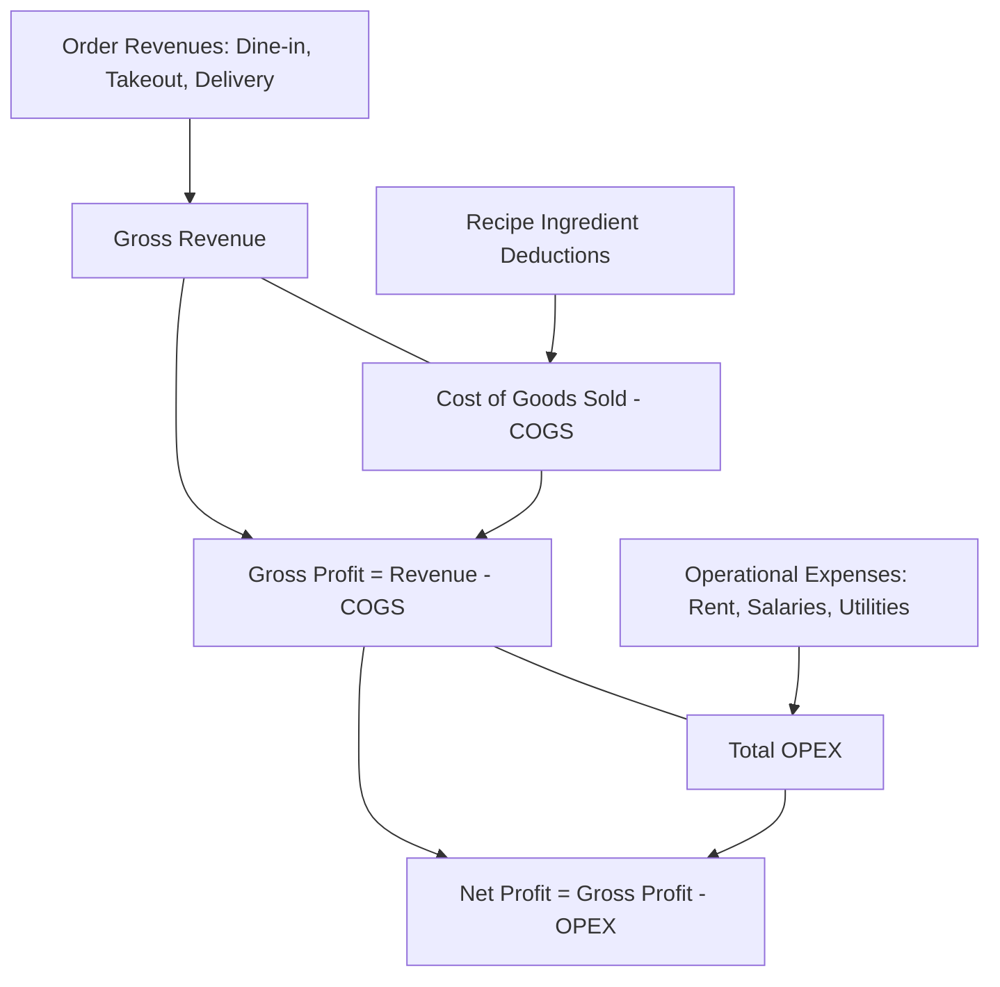

# Module 05: Financial Analytics & Net Profit Intelligence

## 1. Overview & Operational Goals
The Financial Analytics & Net Profit module gives the restaurant owner visibility into true bottom-line profitability. Instead of guessing margins or relying only on gross revenue, the system dynamically calculates realized Cost of Goods Sold (COGS), categorizes revenue across sales channels, and deducts operational expenses (OPEX).

### Key Capabilities:
1. **Real-time Cost of Goods Sold (COGS)**: Automatically aggregated from ingredient deductions for every individual dish sold.
2. **Sales Channel Revenue Decomposition**: Real-time sales split across `dine_in`, `takeout`, and `delivery`.
3. **Operational Expenditure (OPEX) Logging**: Fast entry for fixed and variable costs (Rent, Utilities, Staff Salaries, Maintenance, Misc).
4. **True Net Profit & Margin Analysis**:
   $$\text{Gross Profit} = \text{Total Revenue} - \text{Total COGS}$$
   $$\text{Net Profit} = \text{Gross Profit} - \text{Total OPEX}$$
5. **Dish-by-Dish Profit Matrix (Menu Engineering)**: Identifies high-margin "Stars", steady "Plowhorses", and loss-making "Dogs".

---

## 2. Financial Metrics & Calculation Pipeline



---

## 3. Menu Engineering Matrix (Profitability vs Popularity)

The system automatically places each menu item into one of four operational quadrants:

```
                  High Profit Margin
                          │
          [PUZZLES]       │       [STARS]
     High Margin, Low Vol │ High Margin, High Vol
    ──────────────────────┼──────────────────────
          [DOGS]          │     [PLOWHORSES]
     Low Margin, Low Vol  │ Low Margin, High Vol
                          │
                  Low Profit Margin
 ◄── Low Popularity ────────────── High Popularity ──►
```

- **Stars (High Profit, High Sales)**: Maintain recipe consistency, prominent placement on digital menu.
- **Plowhorses (Low Profit, High Sales)**: High demand but tight margins; recommend slight price increases or portion adjustments.
- **Puzzles (High Profit, Low Sales)**: Highly profitable; feature as "Chef's Special" or run promotions to increase volume.
- **Dogs (Low Profit, Low Sales)**: Candidates for removal or complete recipe revamp.

---

## 4. Expense Categorization & Tracking

Managers record daily and monthly overhead in `/admin/finance`:

| Expense Category | Examples | Frequency |
|---|---|---|
| `rent` | Physical restaurant premises lease | Monthly |
| `salaries` | Auto-calculated from `staff.base_salary` + logged bonuses | Monthly |
| `utilities` | Electricity, Water, Internet, Cooking Gas | Monthly / Bi-weekly |
| `supplies` | Takeout containers, napkins, cleaning chemicals | Weekly / Ad-hoc |
| `maintenance` | Kitchen equipment repairs, plumbing | Ad-hoc |
| `misc` | Licenses, municipal fees, marketing | Ad-hoc |

---

## 5. Owner Financial Dashboard KPIs

In `/admin/finance/page.tsx`, the owner monitors:
1. **Daily / Weekly / Monthly Net Profit**: Live trend chart with previous period comparison.
2. **Food Cost Percentage**: Standard target is 28% – 35% ($\frac{\text{COGS}}{\text{Revenue}} \times 100$).
3. **Channel Contribution**: Bar graph comparing Dine-in vs Takeout vs Delivery profitability.
4. **Top 5 Revenue Generators vs Top 5 Cost Eaters**.
